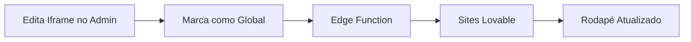

# 🚀 Sistema de Rodapé Global com Atualizações Automáticas

## 📋 Visão Geral

Este sistema permite que você configure um rodapé (iframe) que aparecerá automaticamente em todos os sites Lovable onde você adicionar um simples código de 2 linhas. Quando você atualizar o rodapé no admin, **todos os sites serão atualizados automaticamente** em até 5 minutos.

## 🎯 Como Funciona



1. Você configura o iframe no painel admin
2. Marca como "Rodapé Global"
3. O Edge Function serve o código para todos os sites
4. Sites atualizam automaticamente (cache de 5 min)

## ⚙️ Configuração Inicial

### Passo 1: Configurar o Iframe no Admin

1. Acesse `/admin` no seu projeto
2. Vá para a aba **"Configuração de iframes"**
3. Clique em **"Adicionar iframe"** ou edite um existente
4. Preencha:
   - **Nome**: Ex: "Rodapé MonteSite"
   - **Código do iframe**: Cole o HTML do seu rodapé
   - **Ativo**: Marque como ativo
   - **✅ Usar como rodapé global**: Marque esta opção
5. Clique em **"Salvar"**

### Passo 2: Adicionar Código nos Sites Lovable

Adicione estas 2 linhas no rodapé de cada site Lovable que você criar:

```html
<div id="montesite-footer-badge"></div>
<script src="https://vaabpicspdbolvutnscp.supabase.co/functions/v1/get-footer-iframe"></script>
```

#### Exemplo de Implementação no Footer.tsx:

```tsx
import React from 'react';

const Footer = () => {
  return (
    <footer className="bg-gray-100 dark:bg-gray-900 py-8">
      <div className="container mx-auto px-4">
        {/* Conteúdo do footer */}
        <p className="text-center text-gray-600 dark:text-gray-400">
          © 2025 Minha Empresa. Todos os direitos reservados.
        </p>
        
        {/* Rodapé Global MonteSite - Atualizações Automáticas */}
        <div id="montesite-footer-badge"></div>
        <script src="https://vaabpicspdbolvutnscp.supabase.co/functions/v1/get-footer-iframe"></script>
      </div>
    </footer>
  );
};

export default Footer;
```

## 🔄 Atualizando o Rodapé em Todos os Sites

1. Acesse `/admin`
2. Vá para **"Configuração de iframes"**
3. Clique em **"Editar"** no iframe marcado como "Ativo Globalmente"
4. Faça suas alterações no código HTML
5. Clique em **"Salvar"**
6. **Pronto!** Todos os sites serão atualizados automaticamente em até 5 minutos

## 📊 Recursos Disponíveis

### Painel Admin

- ✅ **Gerenciar múltiplos iframes**: Crie vários iframes para diferentes propósitos
- ✅ **Apenas um global por vez**: Apenas um iframe pode estar ativo globalmente
- ✅ **Preview em tempo real**: Veja como ficará antes de salvar
- ✅ **Status visual**: Badge mostra qual iframe está ativo globalmente
- ✅ **Copiar código**: Botão para copiar código de integração

### Edge Function

- ✅ **Cache de 5 minutos**: Performance otimizada
- ✅ **CORS configurado**: Funciona em qualquer domínio
- ✅ **Logs detalhados**: Facilita debug
- ✅ **Fallback gracioso**: Não quebra o site se houver erro
- ✅ **Público (sem autenticação)**: Não precisa de token

## 🎨 Exemplos de Código para Rodapé

### Opção 1: Rodapé com Logo
```html
<div style="text-align: center; padding: 20px; font-family: system-ui, -apple-system, sans-serif;">
  <a href="https://lp.montesite.com.br/" target="_blank" rel="noopener noreferrer" style="display: inline-flex; align-items: center; gap: 8px; text-decoration: none; color: #333; transition: opacity 0.2s;">
    
    <span style="font-size: 14px; font-weight: 500;">desenvolvido por <span style="color: #0080FF; font-weight: 600;">Monte</span><span style="font-weight: 600;">Site</span></span>
  </a>
</div>
```

### Opção 2: Rodapé Apenas Texto
```html
<div style="text-align: center; padding: 20px; font-family: system-ui, -apple-system, sans-serif;">
  <a href="https://lp.montesite.com.br/" target="_blank" rel="noopener noreferrer" style="text-decoration: none; font-size: 14px; color: #333; transition: opacity 0.2s;">
    desenvolvido por <span style="color: #0080FF; font-weight: 600;">Monte</span><span style="font-weight: 600;">Site</span>
  </a>
</div>
```

### Opção 3: Rodapé Minimalista
```html
<div style="text-align: center; padding: 15px;">
  <a href="https://lp.montesite.com.br/" target="_blank" rel="noopener noreferrer" style="text-decoration: none; font-size: 12px; color: #666;">
    desenvolvido por <strong style="color: #0080FF;">MonteSite</strong>
  </a>
</div>
```

## 🔍 Debugging e Troubleshooting

### Verificar se o Rodapé Está Carregando

Abra o Console do navegador (F12) e procure por:

```
MonteSite Footer: Rodapé carregado com sucesso (Nome do Iframe)
```

### Mensagens de Erro Comuns

#### "Container #montesite-footer-badge não encontrado"
**Causa**: O elemento `<div id="montesite-footer-badge"></div>` não existe no HTML.  
**Solução**: Adicione o div antes do script.

#### "Nenhum iframe globalmente ativo configurado"
**Causa**: Nenhum iframe está marcado como "Rodapé Global" no admin.  
**Solução**: Edite um iframe no admin e marque a opção "Usar como rodapé global".

### Cache

O sistema usa cache de 5 minutos para performance. Se você fez uma alteração e não vê imediatamente:

1. Aguarde 5 minutos
2. Limpe o cache do navegador (Ctrl+Shift+R)
3. Verifique o console para mensagens de erro

## 📈 Estatísticas e Monitoramento

### Ver Logs do Edge Function

1. Acesse o [Supabase Dashboard](https://supabase.com/dashboard/project/vaabpicspdbolvutnscp/functions/get-footer-iframe/logs)
2. Visualize requisições em tempo real
3. Identifique erros e performance

### Logs Disponíveis

```javascript
// Sucesso
"Fetching global active iframe config..."
"Found iframe config: Nome do Iframe"

// Erro
"No global active iframe found"
"Error fetching iframe config: [detalhes]"
```

## 🔒 Segurança

- ✅ **CORS configurado**: Aceita requisições de qualquer origem
- ✅ **Sem autenticação necessária**: Edge function é público
- ✅ **Conteúdo sanitizado**: O código HTML é tratado de forma segura
- ✅ **Apenas um iframe global**: Trigger no banco previne múltiplos ativos

## 💡 Dicas e Boas Práticas

### Performance

1. **Mantenha o código HTML leve**: Evite scripts pesados
2. **Use imagens otimizadas**: Comprima logos e ícones
3. **Teste em diferentes telas**: Verifique responsividade
4. **Cache de 5 min é ideal**: Equilibra atualizações e performance

### Manutenção

1. **Use nomes descritivos**: Facilita identificação no admin
2. **Teste antes de ativar globalmente**: Use preview no admin
3. **Documente mudanças**: Mantenha histórico de alterações
4. **Monitore logs**: Verifique se há erros

### Design

1. **Seja discreto**: O rodapé não deve ofuscar o conteúdo
2. **Mantenha consistência**: Use as cores da marca MonteSite
3. **Adicione hover effects**: Melhora UX
4. **Seja responsivo**: Teste em mobile e desktop

## 🚨 Limitações

1. **Cache de 5 minutos**: Mudanças não são instantâneas
2. **Apenas um iframe global**: Não é possível ter múltiplos rodapés globais simultâneos
3. **Requer JavaScript**: Sites sem JS não carregarão o rodapé
4. **Limites do Supabase Free Tier**: 
   - 500K requisições/mês
   - 2GB bandwidth/mês

## 📞 Suporte

Em caso de dúvidas ou problemas:

1. Verifique os logs no Console do navegador
2. Consulte os logs do Edge Function no Supabase
3. Revise este documento
4. Entre em contato com o suporte técnico

## 🎉 Pronto!

Agora você tem um sistema completo de rodapé com atualizações automáticas! Edite uma vez no admin e veja as mudanças aparecerem em todos os sites.
